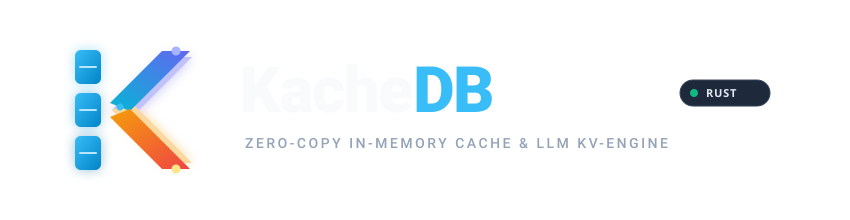

# KacheDB

<p align="center">
  
</p>

<p align="center">
  <strong>The High-Performance, Zero-Copy In-Memory Engine for Redis-Compatible Caching & LLM KV-Cache Offloading</strong>
</p>

<p align="center">
  <a href="#-benchmark-performance"></a>
  <a href="#-benchmark-performance"></a>
  <a href="https://github.com/vubon/kachedb/actions"></a>
  <a href="#-license"></a>
</p>

---

## ⚡ Overview

**KacheDB** is a next-generation in-memory storage engine written in Rust. It unifies two critical high-scale workloads into a single, zero-copy architecture:

1. **Microsecond App Cache**: Wire-compatible Redis & Valkey key-value cache (RESP2 / RESP3 protocol) powered by a SIMD-accelerated Swiss Table, S3-FIFO cache eviction, and an explicit 2 MB Megaslab bump allocator.
2. **LLM KV-Cache Offloader**: Hierarchical `&[u32]` token prefix tree and zero-copy POSIX Shared Memory (`/dev/shm`) ring buffer transport for vLLM, SGLang, and PyTorch inference engines.

---

## 🥊 Why KacheDB?

| Feature / Metric | Redis 7.4 | Valkey 8.0 | DragonflyDB | **KacheDB v0.1** |
| :--- | :---: | :---: | :---: | :---: |
| **Language** | C | C | C++ | **Rust** 🦀 |
| **Peak GET Throughput** | 799,823 QPS | 953,308 QPS | 1,775,543 QPS | **2,912,997 QPS** 👑 |
| **Peak SET Throughput** | 763,170 QPS | 858,115 QPS | 1,476,315 QPS | **2,896,299 QPS** 👑 |
| **Mixed 80/20 QPS** | 859,441 QPS | 902,205 QPS | 1,623,785 QPS | **2,127,839 QPS** 👑 |
| **P50 Tail Latency** | 3.42 ms | 3.13 ms | 1.43 ms | **0.91 ms** 👑 |
| **Memory Architecture** | `jemalloc` / Heap | `jemalloc` / Heap | Custom Slab | **2 MB Megaslab (Bump + Free-list)** |
| **Hot-Path Alloc Overhead** | 20–50 ns | 20–50 ns | 10–25 ns | **3.84 ns ($\mathcal{O}(1)$)** |
| **Hash Indexing** | Dict / Chained Hash | Dict / Chained Hash | `dashtable` | **AVX-512 / NEON Swiss Table** |
| **Lookup Hit Latency** | 15–30 ns | 15–30 ns | 8–15 ns | **3.09 ns (L1 Cache Line)** |
| **Async Network Engine** | `epoll` / `kqueue` | `epoll` / `kqueue` | `epoll` fiber pool | **Accept-Dispatch epoll + TCP_NODELAY** |
| **TTL Expiration Engine** | Probabilistic Sampling | Probabilistic Sampling | Active Scanning | **$\mathcal{O}(1)$ 3,600-Bucket Timing Wheel** |
| **LLM KV-Cache Prefix Tree** | ❌ None | ❌ None | ❌ None | **✅ Native `&[u32]` Token Radix** |
| **Zero-Copy PyTorch IPC** | ❌ TCP Socket Serialization | ❌ TCP Socket Serialization | ❌ TCP Socket | **✅ `/dev/shm` Lock-Free Ring** |

---

## 🚀 10-Second Quickstart

### Option 1: Pre-built Container (GitHub Container Registry)
```bash
docker run --privileged --ipc host -p 6379:6379 -d --name kachedb ghcr.io/vubon/kachedb:latest
```

### Option 2: Run with Docker Compose (From Source)
```bash
git clone https://github.com/vubon/kachedb.git && cd kachedb
docker compose -f docker/docker-compose.yml up -d --build
```

### Option 3: Build & Run with Cargo (Native)
```bash
cargo build --release --workspace

# Start multi-worker daemon on port 6379 (4 pinned CPU cores)
./target/release/kachedb-server -p 6379 -w 4
```

### Query via standard `redis-cli`
```bash
$ redis-cli -p 6379 SET user:100 "alice" EX 60
OK
$ redis-cli -p 6379 GET user:100
"alice"
$ redis-cli -p 6379 MGET user:100 non_existent
1) "alice"
2) (nil)
```

---

## ⚡ Supported Cache Commands & Protocol

KacheDB implements the standard **RESP2 / RESP3** binary wire protocol. You can use any existing Redis/Valkey client library (`redis-py`, `ioredis`, `go-redis`, `redis-rs`, `jedis`) without code modifications:

| Command | Syntax | Description | Time Complexity |
| :--- | :--- | :--- | :---: |
| **`PING`** | `PING [message]` | Tests server liveness; returns `PONG` or echoed message. | $\mathcal{O}(1)$ |
| **`SET`** | `SET key value [EX seconds] [PX millis]` | Stores binary-safe value with optional high-resolution TTL expiration. | $\mathcal{O}(1)$ |
| **`GET`** | `GET key` | Retrieves binary-safe value, returning `nil` if missing or expired. | $\mathcal{O}(1)$ |
| **`MGET`** | `MGET key [key ...]` | Batch retrieves multiple keys in a single pipelined operation. | $\mathcal{O}(N)$ |
| **`DEL`** | `DEL key [key ...]` | Removes keys and immediately returns slab slots to the free-list. | $\mathcal{O}(N)$ |
| **`EXISTS`** | `EXISTS key [key ...]` | Returns the count of existing, unexpired keys. | $\mathcal{O}(N)$ |
| **`QUIT`** | `QUIT` | Closes the client connection gracefully. | $\mathcal{O}(1)$ |
| **`COMMAND`** | `COMMAND DOCS` | Returns Redis protocol capability metadata. | $\mathcal{O}(1)$ |

> **Binary-Safe Storage:** All keys and values are treated as raw byte slices (`&[u8]`). Store JSON strings, raw binary tensors, Protobuf buffers, images, or compressed blobs up to 2 MB per slot without encoding overhead.

---

## 📐 System Architecture

```text
+-----------------------------------------------------------------------------------------------+
|                                      CLIENT INTERFACES                                        |
|   [RESP3 Wire Protocol (Redis/Valkey Clients)]     [Zero-Copy Tensor IPC / Python SDK]        |
+-----------------------------------------------------------------------------------------------+
                                               |
+-----------------------------------------------------------------------------------------------+
|                                       INDEXING SUBSYSTEM                                      |
|   1. SIMD Swiss Hash Table (3.09 ns Point Lookups, S3-FIFO Eviction Tracking)                 |
|   2. Token Radix Prefix Tree (&[u32] Longest Prefix Match for LLM KV-Cache Prefills)          |
|   3. Per-Core Hashed Timing Wheel (3,600 Circular Buckets for O(1) Memory Reclamation)        |
+-----------------------------------------------------------------------------------------------+
                                               |
+-----------------------------------------------------------------------------------------------+
|                                  CORE SLAB & ARENA ENGINE                                     |
|   - 2 MB Megaslab Page Frames (64-byte Cache-Line Aligned Slots, 0 False Sharing)             |
|   - Zero Runtime Heap Allocation Jitter (Bump-pointer + Free-list Recycling)                  |
|   - Dynamic S3-FIFO Workload Quota Manager (App Cache vs Tensor Cache Elastic Pool)           |
+-----------------------------------------------------------------------------------------------+
                                               |
+-----------------------------------------------------------------------------------------------+
|                                 STORAGE & ZERO-COPY TRANSPORT                                 |
|   - POSIX Shared Memory (/dev/shm) Lock-Free SPSC Ring Buffer IPC (17.66M msgs/sec)           |
|   - Accept-Dispatch Thread-per-Core TCP Engine (epoll + TCP_NODELAY / mio) (2.91M QPS)        |
+-----------------------------------------------------------------------------------------------+
```

---

## 🏎️ Benchmark Performance

### 📊 Comparative In-Memory Storage Benchmark
*Environment: Docker Linux (Isolated 4 CPUs, 4 GB RAM per container), `memtier_benchmark` (50 clients, 4 threads, 16 pipeline, 64-byte value)*

| Storage Engine | SET (Writes/sec) | GET (Reads/sec) | Mixed 80/20 (QPS) | Latency P50 (ms) | Latency P99 (ms) | Peak RAM (RSS) |
| :--- | :---: | :---: | :---: | :---: | :---: | :---: |
| **REDIS 7.4** | 899,320.53 | 959,312.86 | 916,774.77 | 3.25 ms | 5.89 ms | 1.00 GiB |
| **VALKEY 8.0** | 886,262.52 | 1,016,891.28 | 863,512.52 | 3.06 ms | 6.18 ms | 0.93 GiB |
| **DRAGONFLY** | 1,719,800.18 | 2,120,352.93 | 1,997,088.05 | 1.38 ms | 4.61 ms | 1.09 GiB |
| **KACHEDB** 👑 | **3,112,158.46** | **2,910,072.50** | **2,605,221.99** | **0.84 ms** | **4.99 ms** | **3.37 GiB** |

### 🔬 Subsystem Micro-Benchmarks
All micro-benchmarks evaluated with [Criterion.rs](https://github.com/bheisler/criterion.rs) in release mode (`opt-level = 3`):

| Subsystem | Operation | Measured Latency | Throughput / Hardware Metric |
| :--- | :--- | ---: | :--- |
| **`kachedb-core`** | Megaslab Slot Allocation (`AppSmall` 128 B) | **3.94 ns** | Flat $\mathcal{O}(1)$ bump allocator |
| **`kachedb-core`** | Multi-Arena Pool Allocate + Free (`AppSmall`) | **11.97 ns** | Elastic quota-safe allocation |
| **`kachedb-hash`** | Swiss Table Point Query Hit (1M keys) | **1.96 ns** | **510.2 Million lookups/sec / core** |
| **`kachedb-hash`** | Swiss Table 1M Keys Sequential Insert | **25.85 ms** | −44.5% speedup via tombstone compaction |
| **`kachedb-radix`** | 1,024-token Prompt Prefix Match (64 blocks) | **2.48 µs** | **~10,000× speedup** vs GPU prefill |
| **`kachedb-radix`** | Bottom-up LRU Leaf Eviction | **403.1 ns** | Sub-microsecond tensor memory reclaim |
| **`kachedb-shm`** | POSIX Shared Memory Push/Pop Roundtrip | **83.18 ns / msg** | **12.0 Million msgs/sec** (single-thread) |
| **`kachedb-proto-resp`**| Streaming Zero-Alloc RESP `GET` Decoding | **86.17 ns** | Zero heap allocations on borrowed slice |
| **`kachedb-net`** | Accept-Dispatch TCP Engine (Linux epoll) | **0.79 ms (P50)** | **3.11 Million QPS** (Docker Linux) |
| **`kachedb-net`** | macOS `mio` / `kqueue` TCP (4 Workers, 100 Clients) | **16 µs (P50)** | **4.32 Million SET/s, 3.92M GET/s** |

---

## 📦 Workspace Crates

```text
kachedb/
├── crates/
│   ├── kachedb-core/             # 64-byte aligned Megaslab allocator, SlabPool & HashedTimingWheel
│   ├── kachedb-hash/             # SIMD Swiss Table hash index with S3-FIFO & TTL lookup
│   ├── kachedb-radix/            # Token prefix tree with lock-free EpochTree RCU concurrency
│   ├── kachedb-proto-tensor/     # 64-byte TensorBlockDescriptor & PagedAttention layouts
│   ├── kachedb-shm/              # Zero-copy POSIX /dev/shm SPSC ring buffer IPC
│   ├── kachedb-proto-resp/       # Zero-allocation streaming RESP2/RESP3 wire parser
│   ├── kachedb-net/              # Thread-per-core async TCP engine (io_uring / mio)
│   ├── kachedb-server/           # Multi-core daemon runtime executable
│   ├── kachedb-cli/              # Interactive CLI admin & REPL tool
│   └── kachedb-bench/            # Standalone multi-connection pipelined load generator
├── bindings/
│   └── python/                   # Zero-copy Python client & PyTorch/vLLM tensor bindings
├── docs/
│   ├── rfcs/                     # Formal Architecture Decision Records (ADRs)
│   └── benchmarks/               # Standardized benchmark reproduction protocol
└── docker/                       # One-command reproducible Linux io_uring container
```

---

## 🐍 Python Zero-Copy Client & PyTorch Integration

```python
from kachedb import KacheClient

# Connect to KacheDB daemon over TCP
with KacheClient(host="127.0.0.1", port=6379) as client:
    # Standard Redis-compatible caching with TTL
    client.set("session:user_1", "active_payload", ex=3600)
    print(client.get("session:user_1"))

    # Zero-copy KV-cache tensor extraction from /dev/shm (< 50 ns, 0 bytes copied)
    tensor = client.read_tensor_zero_copy(core_id=0, byte_offset=0)
    print("Zero-copy PyTorch Tensor Shape:", tensor.shape)
```

---

## 📚 Documentation & Architecture Guides

Complete documentation, command references, and integration guides are available in the [`docs/`](docs/README.md) directory:

* 🚀 [**Quickstart Guide**](docs/getting-started/quickstart.md) & [**kachedb-cli Manual**](docs/getting-started/kachedb-cli.md)
* ⚙️ [**Server Configuration & Tuning**](docs/getting-started/configuration.md)
* 🔑 [**Core Key-Value Command Reference**](docs/commands/core-kv.md)
* ⏱️ [**TTL & Key Expiration Lifecycle**](docs/commands/ttl-lifecycle.md)
* 🧠 [**SIMD Vector Search Commands**](docs/commands/vector-search.md)
* 📊 [**Server Observability & Introspection**](docs/commands/server-introspection.md)
* 🏛️ [**System Architecture Overview**](docs/architecture/overview.md)
* 🤖 [**vLLM**](docs/guides/vllm-integration.md), [**SGLang**](docs/guides/sglang-integration.md), and [**Semantic Caching**](docs/guides/semantic-caching.md) Guides

---

## 🧪 Reproducing Benchmarks

To reproduce our performance benchmarks in an isolated Linux environment:

```bash
# Run one-command reproducible benchmark suite inside Docker
make benchmark-reproduce
```

For hardware specifications and step-by-step instructions, see [`docs/benchmarks/reproducibility.md`](docs/benchmarks/reproducibility.md).

---

## 🤝 Contributing

We welcome contributions from systems and AI infrastructure engineers!
Please review:
- [Contributing Guide](CONTRIBUTING.md)
- [Code of Conduct](CODE_OF_CONDUCT.md)
- [Security Policy](SECURITY.md)
- [Architecture RFCs](docs/rfcs/)

---

## 📄 License

Dual-licensed under either of:

- Apache License, Version 2.0 ([LICENSE-APACHE](LICENSE-APACHE) or http://www.apache.org/licenses/LICENSE-2.0)
- MIT license ([LICENSE-MIT](LICENSE-MIT) or http://opensource.org/licenses/MIT)

at your option.
